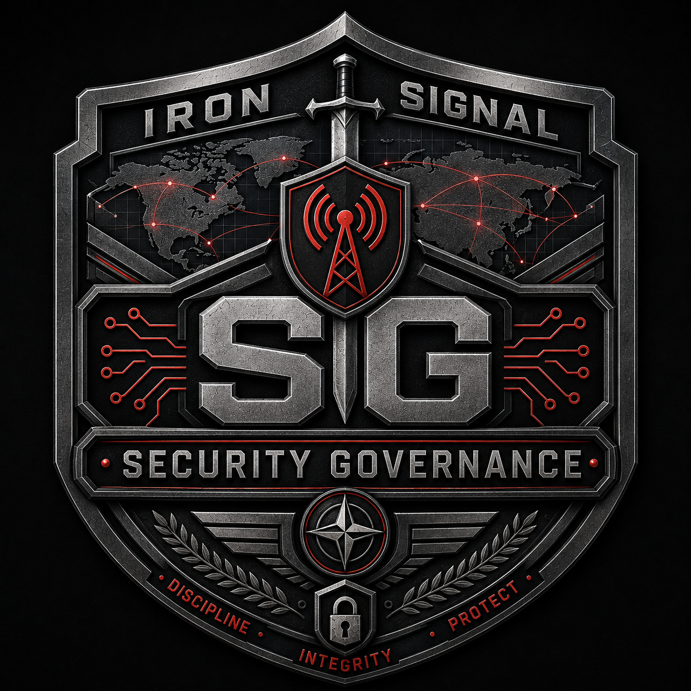

# Iron Signal Systems Security Governance

  

This repository defines the organizational security governance system for Iron Signal Systems.

It governs organizational security responsibilities including risk management, identity and access management, incident response, business continuity, supplier security, information classification, security awareness, organizational exceptions, and governance review.

It does not replace the Iron Signal Repository Assurance Standard (ISRAS). ISRAS remains the engineering assurance authority for Iron Signal Systems repositories and software lifecycle controls.

## Current organizational state

Iron Signal Systems is currently operated as a solo-developed project and has
not been formed as a separate legal business entity.

This governance system applies to software, repositories, infrastructure,
information, services, and other work conducted under the Iron Signal Systems
name.

Governance roles describe responsibilities and authority. They do not imply the
existence of employees, officers, departments, a corporation, an LLC, or another
separate legal entity.

The governance model shall be reviewed when the organizational or legal
structure materially changes.

## Authority boundaries

- `security-governance`: organizational security governance and ISMS/GRC controls.
- `engineering-standards`: ISRAS engineering assurance authority.
- product repositories: product architecture, runtime behavior, domain requirements, and product-specific controls.

## Current status

**Foundation scaffold — not certified and not yet adopted as an accepted ISRAS-governed repository.**

External certification and framework mapping are intentionally out of scope for this foundation scaffold.

## Repository layout

- `GOVERNANCE.md` — organizational governance authority and principles.
- `SECURITY-POLICY.md` — top-level information security policy.
- `controls/` — ISS control catalog and machine-readable control registry.
- `policies/` — operational policy documents.
- `registers/` — risks, assets, suppliers, and exceptions.
- `records/` — guidance for retained control records; sensitive records should not be committed here unless explicitly safe.

## Governing rule

Define and operate real ISS controls first. External certification and framework mapping come later, after the controls have operating history.
